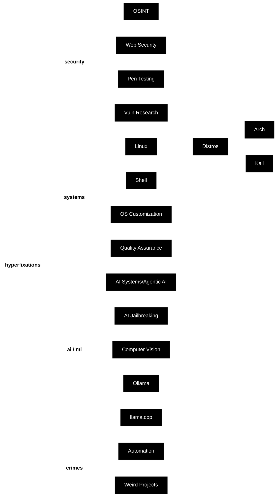

<h1 align="center">hey, i'm sahastranshu 👋</h1>

<b>Offsec | Linux | AI Systems</b>

&nbsp;&nbsp;&nbsp;&nbsp;&nbsp;&nbsp;&nbsp;&nbsp;&nbsp;

---

# whoami
> *Turning 'the code looks fine' into a very long incident report.*

17yo security researcher who likes poking at stuff

---

# hyperfixations

---
# stuff I use

  <picture>
    <source media="(prefers-color-scheme: dark)" srcset="https://raw.githubusercontent.com/sahasx86/sahasx86/main/dark.svg">
    <source media="(prefers-color-scheme: light)" srcset="https://raw.githubusercontent.com/sahasx86/sahasx86/main/light.svg">
    
  </picture>
  

  somewhere between a terminal and a bad idea

